= Instrucciones para Price Forecast.

== Instalar Metamask

Ir a http://metamask.io

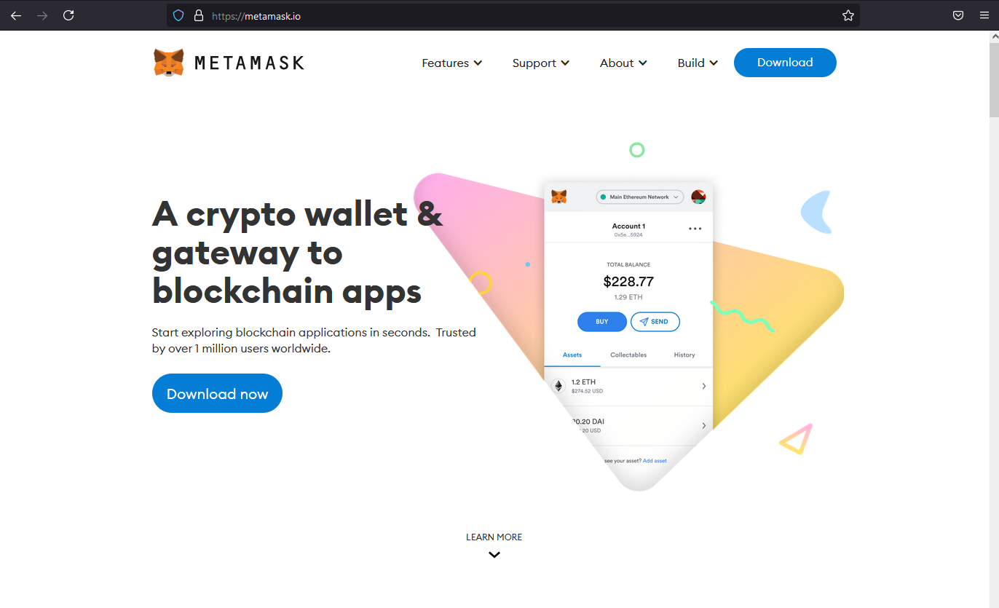

Click en el botón de *Download*

Es necesario instalar la extensión en el navegador (por ahora Price Forecast no es compatible con dispositivos móviles). Elegir el navegador que se desee usar. Metamask es compatible con Chrome, Firefox, Brave y Edge.

Presionar *Install Metamask for Firefox* (o el navegador elegido)

image::assets/image-2021-06-08-20-20-38-181.png[width=1024]

Esto los llevará a la página de Firefox Add-Ons (o del navegador elegido).

image::assets/image-2021-06-08-20-22-23-694.png[width=1024]

Click en el botón *Agregar a Firefox* y seguir las instrucciones.

Firefox pide permiso para añadir la extensión. Click en *Añadir*.

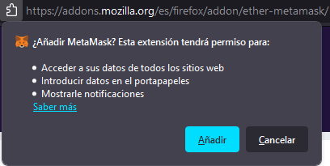

Luego click en el botón *Aceptar* arriba a la derecha, y luego click en *Empezar*

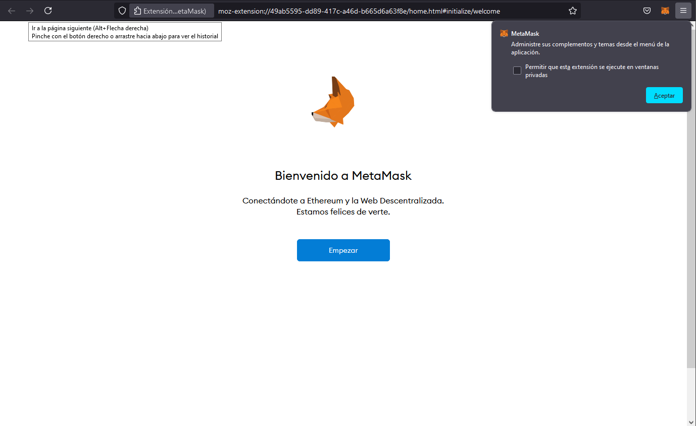

Si estan instalando Metamask supongo que no tendrán ya un monedero creado, por lo tanto click en *Crear Monedero*.

image::assets/image-2021-06-08-20-29-12-123.png[width=1024]

Leer la siguiente pantalla y click en *Estoy de acuerdo*.

image::assets/image-2021-06-08-20-37-24-782.png[width=1024]

Ingresar la contraseña (se va a necesitar cada vez que reinicien en navegador y activen Metamask, por lo tanto guárdenla en lugar seguro, o mejor aún, usen un gestor de contraseñas como por ejemplo https://bitwarden.com/)
Marcar en *Leí y acepto Términos de Uso*, y luego click en *Crear*.

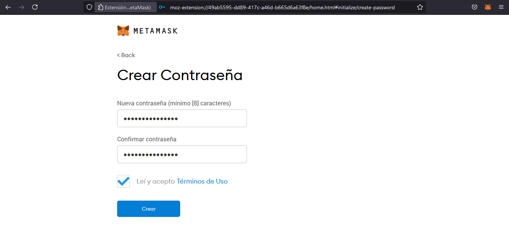

Luego viene la parte de la Frase de Respaldo Secreta. Estas 12 palabras se pueden usar en caso de olvidar la contraseña, o querer activar el mismo monedero Metamask en otro dispositivo. La frase se puede descargar a un archivo o copiarse a un papel, o también se puede guardar en un gestor de contraseñas.
Hacer click en *Siguiente*.

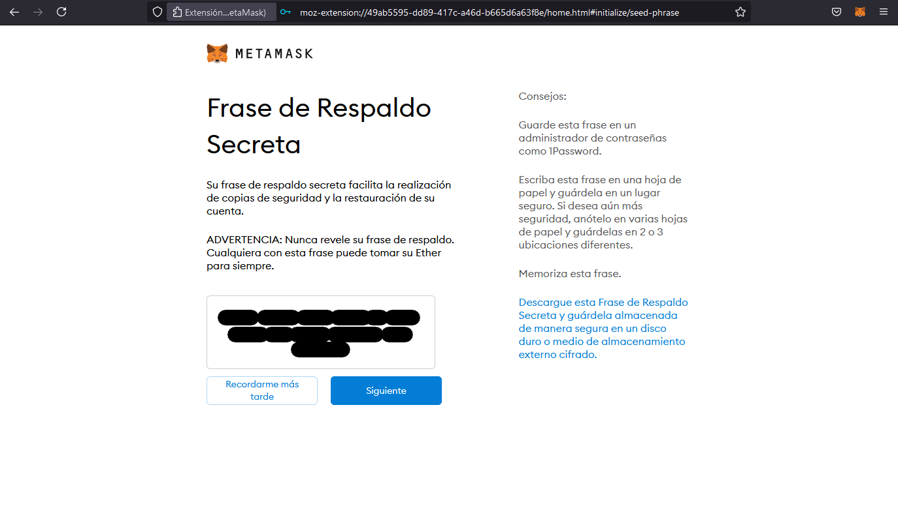

Es necesario confirmar la frase para estar seguros que se guardó correctamente. En este caso, hay que ir eligiendo las palabras _en el orden correcto_ (como se mostraron en la pantalla anterior). Una vez ingresadas todas las palabras, click en *Confirmar*.

image::assets/image-2021-06-08-20-53-15-738.png[width=1377]

Si las palabras se ingresaron correctamente, la siguiente pantalla muestra unos últimos consejos para leer atentamente. Click en *Todo Listo*.

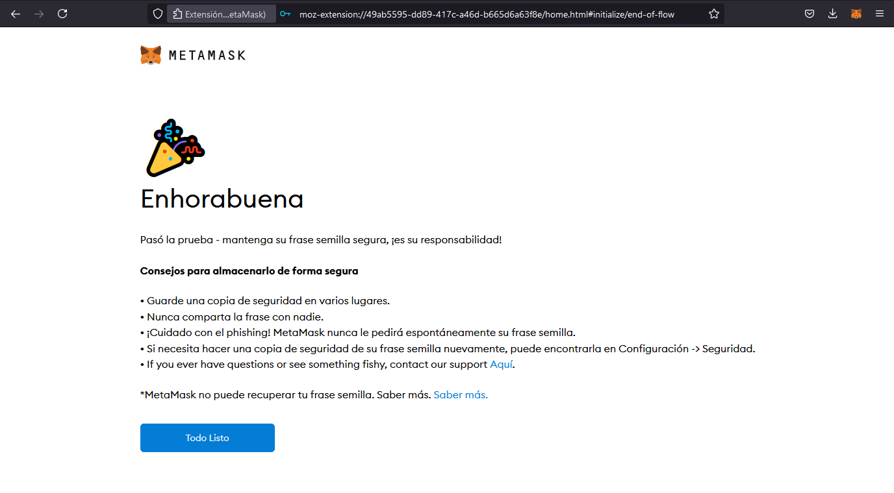

Finalmente, ya está instalada Metamask. Normalmente se puede acceder haciendo click en el emoji del zorrito que aparece arriba a la izquierda, y Metamask aparece como una ventana flotante.

== Agregar la red de prueba de Binance a Metamask

Metamask viene por defecto con conexiones para la red de Ethereum y sus redes de prueba (en la ventana de Metamask se indica arriba de todo). Sin embargo, Price Forecast funciona sobre la red de Binance Smart Chain (BSC), ya que es más rápida y sus comisiones son menores.
Por lo tanto, es necesario agreagar la red de Binance (de prueba por ahora) a Metamask.

Para hacerlo simple, ir a https://chainlist.org/

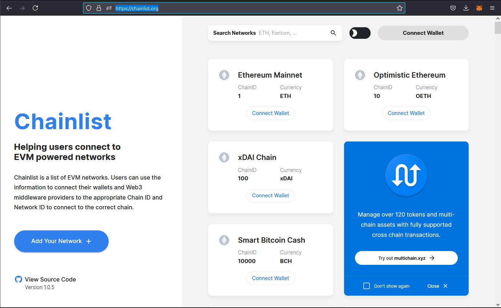

Este sitio permite conectar Metamask automáticamente a varias redes, sin necesidad de ingresar nada manualmente.
Lo primero es conectar Metamask al sitio, para eso hay que hacer click en *Connect Wallet*
Se despliega la ventama de Metamask, indicando que chainlist.org se quiere conectar con Metamask. hacer click en Siguiente.

image::assets/image-2021-06-08-21-40-47-728.png[width=358]

Hacer click en *Conectar*.

image::assets/image-2021-06-08-21-41-48-252.png[]

En unos segundos Metamask estará conectado al sitio de Chainlist, se puede comprobar viendo que en la ventana de Metamask dice _Conectado_ arriba a la izquierda, en la misma página arriba a la derecha aparece el zorrito y la direccion de la cuenta de Metamask.

image::assets/image-2021-06-08-21-44-02-343.png[]

El siguiente paso es agregar Binance Smart Chain Testnet a Metamask. Para ello, ingresar el nro 97 (chain id) en el recuadro *Search Networks*. Elegir el cuadro que pone Binance Smart Chain con ChainId 97 y hacer click en A**dd to Metamask**.

image::assets/image-2021-06-08-21-48-16-930.png[width=1024]

Metamask pedirá confirmar que se quiere agregar la red, hacer click en Approve.

image::assets/image-2021-06-08-21-51-27-747.png[]

Luego pedirá confirmar si se le permite cambiar a la nueva red. Hacer click en *Switch Netowrk*.

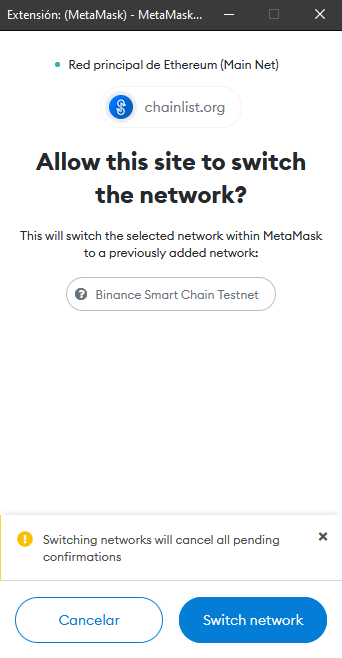

Listo. Al abrir Metamask otra vez se podrá ver que arriba indica que la red actual es Binance Smart Chain Testnet. En caso de querer cambiar a otra red (para volver a la de Ethereum por ejemplo, se puede hacer click en el nombre de la red y elegir la deseada).

image::assets/image-2021-06-08-21-54-39-563.png[]

== Cargar BNB de prueba a Metamask

En estos momentos ya esta Metamask conectada a la red de Binance, pero aún falta lo más importante: cargarle tokens. Como estamos en la red de prueba de Binance, los tokens nativos de esta red son los tBNB (o sea, BNB de prueba).

Para cargar tokens entonces, hay que ir a la faucet (grifo) de BSC Testnet en  https://testnet.binance.org/faucet-smart
Este sitio simplemente hace un envío de tBNB hacia Metamask, y para eso hay que indicarla la dirección de nuestra Metamask.

image::assets/image-2021-06-08-22-02-04-704.png[width=1024]

Para esto simplemente hay que hacer click en la ventana de Metamask donde dice Account 1 (verificar que este elegida la red Binance Smart Chain Testnet), automáticamente la dirección se copia al portapapeles.

image::assets/image-2021-06-08-22-04-15-447.png[]

Luego hay que pegar la dirección en el sitio de la faucet donde pone *Input your Binance Smart Chain address...*  y hacer click en donde pone *Give me BNB* para seleccionar la cantidad. En estos momentos solo ofrece la opción de 1 BNB, pero anteriormente había otra cantidades, por lo que quizá se vean otras opciones también. De cualquie rmanera esto no es demasiado importante, no se necesita demasiado para las pruebas.

image::assets/image-2021-06-08-22-06-44-304.png[width=1024]

Un cartel verde indica que se aceptó el pedido.

image::assets/image-2021-06-08-22-11-50-855.png[width=1024]

En unos segundos debería aparecer 1 TBNB en Metamask.

image::assets/image-2021-06-08-22-12-39-294.png[]

Ya la billetera tiene fondos para interactuar con Price Forecast.

== Interactuando con Price Forecast

Price forecast se encuentra en https://forecast-sage.vercel.app/

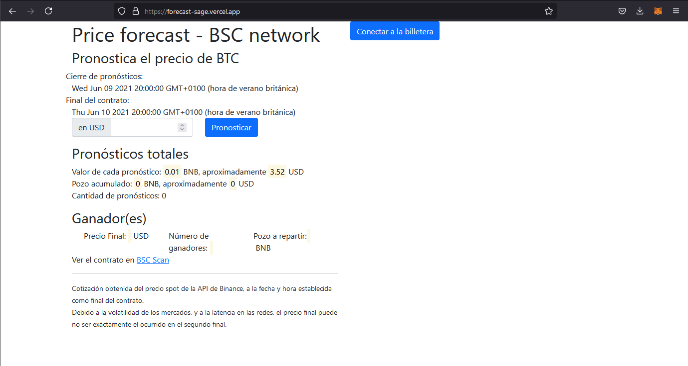

Igualmente que como se hizo con Chainlist, hay que conectar Metamask con Price Forecast. Para eso hacer click en el botón azul *Conectar a la billetera*

Inmediatamente se abrirá Metamask y pedirá permiso para conectarse. Hacer click en Siguiente y luego en Conectar.

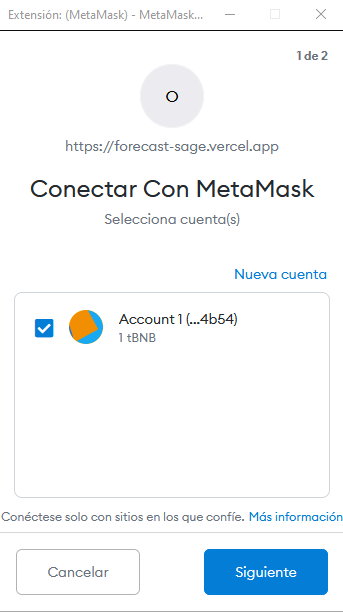

Se puede comprobar que Metamask está conectado a Price Forecast de la misma manera que antes, en la ventana de Metamask arriba a la izquierda pone *Conectado*, y en el sitio el botón es verde y dice *Conectado a la billetera*.

image::assets/image-2021-06-08-22-26-08-601.png[width=1024]

La fecha que se indica como _Cierre de pronósticos_ es la fecha y hora hasta la que se aceptan pronósticos.
La fecha que se indica como _Final del contrato_ es la fecha y hora en el que se toma el precio de la moneda para verificar el o los ganadores, en ese momento el contrato verifica el o los pronósticos más cercanos, y reparte el pozo que se haya acumulado (menos un 5% para pagar los gastos de gas del contrato) a los ganadores. El premio se envía directamente a la Metamask del ganador. Todo esto ocurre sin intervención humana.

Para ingresar un pronóstico, es tan fácil como ingresar el precio pronosticado (en dólares) y hacer click en *Pronosticar*. Se pueden ingresar tantos pronósticos como se desee,

Esto causa que se abra Metamask, ya con los valores cargados: el valor de un pronóstico, y el gas de la transacción. El valor en azul indica el total que se va a descontar de la billetera. Hacer click en *Confirmar*.

image::assets/image-2021-06-08-22-40-45-958.png[width=1024]

Luego de unos segundos, la transacción se confirma. Metamask lo informa con una ventana emergente con el zorrito, y Price Forecast muestra el que pozo acumulado y la cantidad de pronósticos aumentaron.

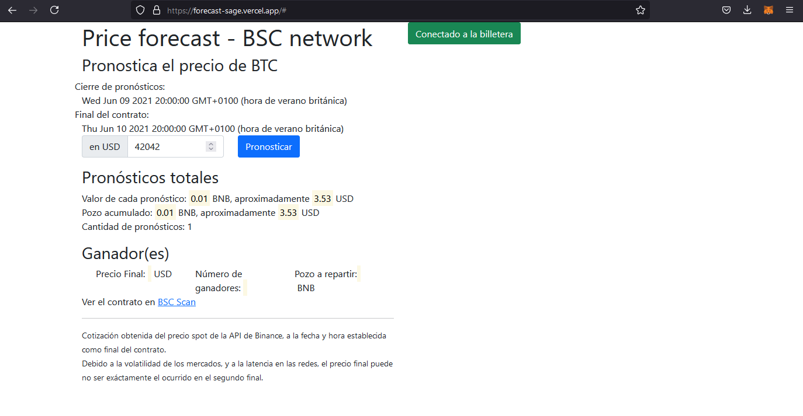

Una vez que pasó la fecha de cierre de pronósticos, al intentar hacer un nuevo pronóstico se obtendrá un error.

Cuando llega la fecha de final del contrato, si el Price Forecast está abierto en el navegador, se mostrará el precio final de la moneda pronosticada, la cantidad de ganadores, y el total de tBNB a repartir.